## Box assembly process

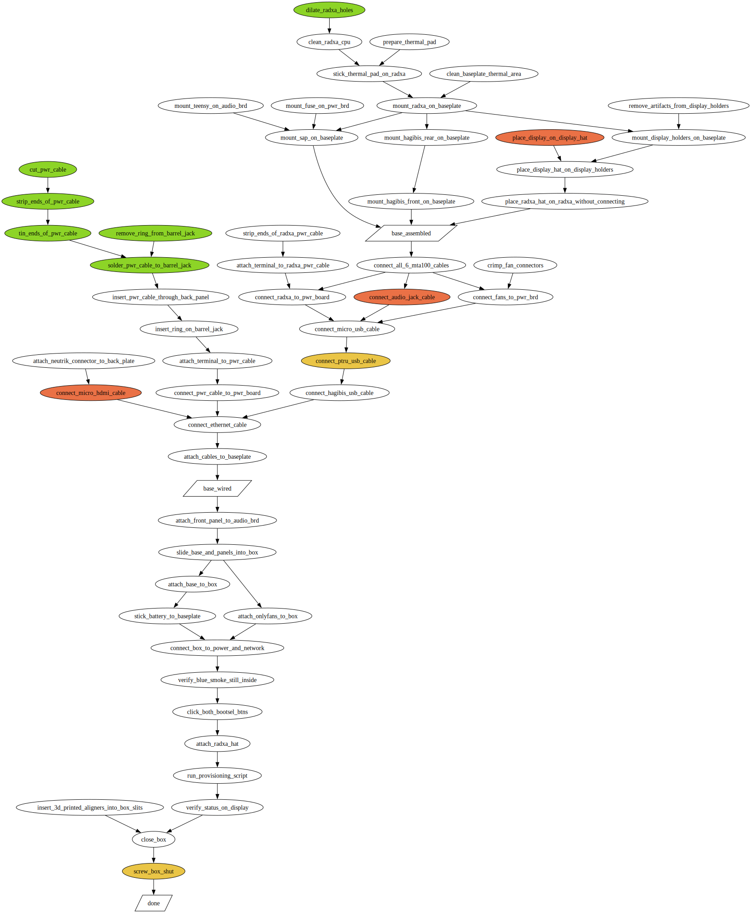

Legend (colours to be removed after assembly on 2024-12-28):
- Green means already done before assembly
- Red means skip (will be done later or not at all)
- Yellow means optional (do only for some of the boxes)

### Before we begin

#### Disassemble old box (`prepare_box`)

When salvaging a pre-2024 FOSDEM box, it should be fully disassembled.

The box should be fully disassembled using a 2mm HEX screwdriver.
The following parts should be salvaged for the new box:

- The lid and bottom
- The 3D-printed inserts that hold the box together
- The HDMI Neutrik connectors, together with their nuts and bolts
- The Hagibis capture card

Everything else can be discarded (not used for the new box).

#### Prepare a new box (`prepare_box`)

In case of using a brand new box ([G17081UBK](https://www.gainta.com/en/g17081ubk.html)), it should be prepared in the following way:

- Discard the unused parts
    - Only the top/bottom halves are used, everything else (front/back covers, planks) is discarded
- Drill the 4mm high screw holes with a 2.8mm drill bit
    - 2.8mm drill bits are very uncommon, make sure you have them available
    - It is best to use a tabletop drill press
    - Do not drill through the whole box, just drill about 3.5mm deep
- Drill through the supports on the bottom half
    - The lid and bottom of the box are identical and each have 4 support columns
    - The bottom supports should be drilled through with a 3mm drill, so that the box can be screwed together
- 3D-printed inserts ([case locks](https://github.com/FOSDEM/video/blob/master/hardware/brackets/case-lock.scad)) for the four corners should be made available

#### Disassemble enclosed Hagibis capture card (`disassemble_hagibis_if_needed`)

If the Hagibis capture card is inside its case, it should be disassembled:
- Remove bumpers on bottom together with any glue residue
- Remove the screws from under the bumper
- Pull on the bottom lid. If needed, insert a thin tool through one of the HDMI port holes and gently push on the sides of the HDMI port to move it downwards. IMPORTANT - you need to push on the sides and not in the middle of the HDMI port, because it will bend.
- Insert the thin tool into the gap between the lid and the case and open the box
- Salvage the board and discard the rest

Discarded parts should be kept in separate containers for further usage.

### Box assembly

#### Attach neutrik connector to back plate (`attach_neutrik_connector_to_back_plate`)

- Use the M3x10 bolts and respective nuts to attach the connector
- One lower bolt may need to be removed if it does not fit with the inner aluminum heatplate

#### Crimp fan connectors (`crimp_fan_connectors`)

- Cut the fan wires to about 70mm
- Hold the [connector](https://www.te.com/en/product-3-640443-3.html) in a vise with the wire slots pointing up. The vise should have a rubber grip. Do not tighten more than needed (the connector should not deform)
- The wire order is as follows (left to right, wires going into the connector from the point of view of the human outwards):
    1. Tach (Yellow)
    2. +5V (Red)
    3. GND (Black)
- If in doubt about the pin order, take a power board and consult the labels on the board
- Use the [MTA100 crimping tool](https://www.modellbahnunion.com/HO-gauge/Crimping-tool.htm?shop=modellbahn-union-en&a=article&ProdNr=Zimo-CRIMPTOOL&p=802) to crimp the individual wires
- It would be beneficial to hold multiple connectors in one vise grip and pipeline the crimping process

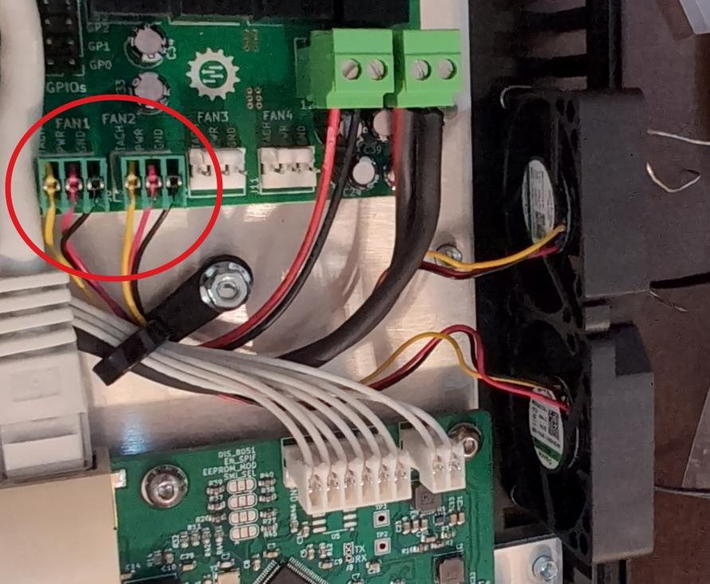

#### Cut power cable (`cut_pwr_cable`)

- Prepare 2x1.5mm² red-black low voltage copper cable
- Cut 260mm of cable

#### Strip ends of power cable (`strip_ends_of_pwr_cable`)

- Use a [wire stripping tool](https://www.knipex.com/products/wire-strippers-and-stripping-tools/knipex-precistrip16/knipex-precistrip16/1252195) to strip about 5mm on each side

#### Tin ends of power cable (`tin_ends_of_pwr_cable`)

- Hold the cable in a vise with the stripped ends pointing upwards or to the side
- Apply flux on wire
- Heat wire with soldering iron while gradually applying enough solder to fill the space between internal strands

#### Remove ring from barrel jack (`remove_ring_from_barrel_jack`)

I always forget to do this and then curse when I get to inserting the barrel jack into the panel.
This should be done before soldering because otherwise the thread might lock because of the heat.

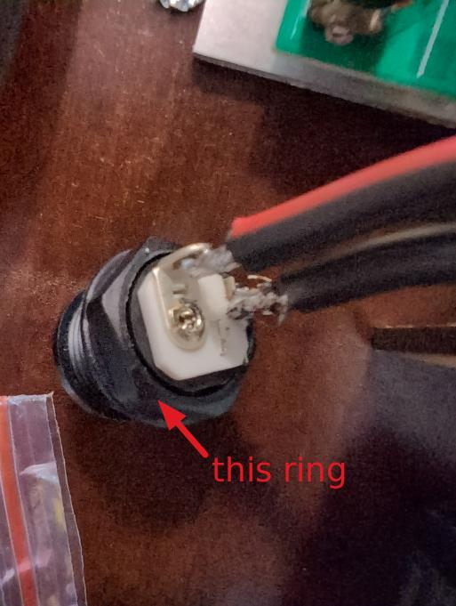

#### Solder power cable to barrel jack (`solder_pwr_cable_to_barrel_jack`)

- Hold the [barrel jack](https://www.schurter.com/en/datasheet/4840.2200) in a vise
- Solder the wires to the pins in the following configuration:
    - The bigger plank is the (+) wire (red cable)
    - The pin opposite that plank is the (-) wire
    - The third pin is unused

#### Insert power cable through back panel (`insert_pwr_cable_through_back_panel`)

Do not forget to do this before attaching the terminal!

#### Insert ring on barrel jack (`insert_ring_on_barrel_jack`)

Do not forget to do this before attaching the terminal!

#### Attach terminal to power cables (`attach_terminal_to_pwr_cable`, `attach_terminal_to_radxa_pwr_cable`))

- Use 1.5mm flathead screwdriver
- Attach a [Plug-in terminal](https://store.comet.bg/Catalogue/Product/45028/) to the wires.
Looking at the terminal from the front (holes), the pin order is the following:
    - Left pin is +12V (red)
    - Right pin is GND (black)
- If in doubt about the pin order, take a power board and consult the labels on the board
- Repeat the steps for both the power cable and the radxa power cable

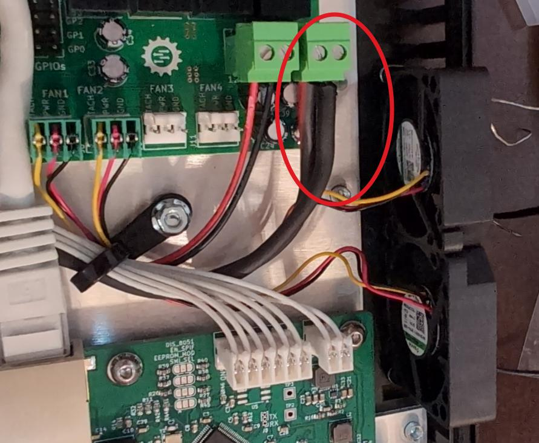
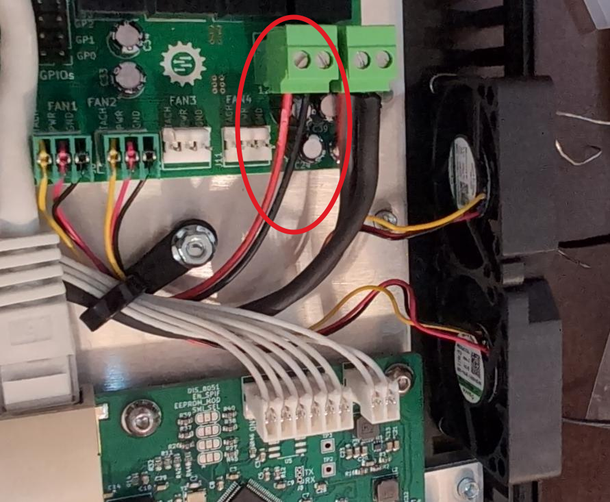

#### Strip ends of radxa power cable (`strip_ends_of_radxa_pwr_cable`)

- The cables come with the ends stripped to about 2mm - they should instead be stripped to 5mm

#### Mount fuse on power brd (`mount_fuse_on_pwr_brd`)

- Snap the fuse onto the fuse holder
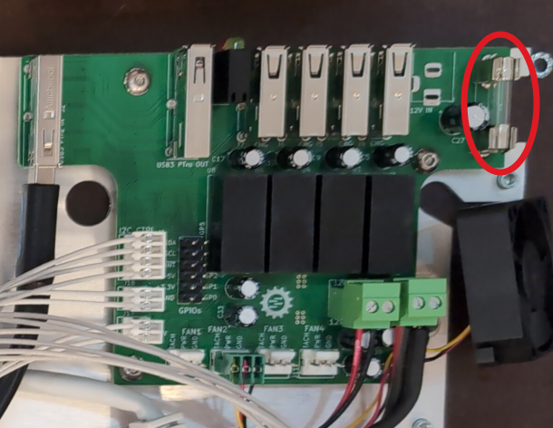

#### Mount teensy on audio brd (`mount_teensy_on_audio_brd`)

- The teensy's direction is indicated by the "USB" label on the silkscreen
- Lay the audio board on a flat, soft surface
- Gently push the teensy downwards with two fingers placed symmetrically

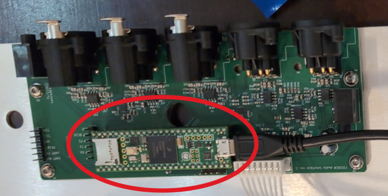

#### Place display on display hat (`place_display_on_display_hat`)

- Push the display onto the header, in a way that all holes align

#### Remove artifacts from display holders (`remove_artifacts_from_display_holders`)

- Use a 4mm drill bit or a knife to remove artifacts from the bottom of the holes

#### Connect micro hdmi cable (`connect_micro_hdmi_cable`)

- The cable should be connected between the port labeled **HDMI1** on the Radxa and the neutrik connector on the back panel

#### Dilate radxa holes (`dilate_radxa_holes`)

- Use a 3mm drill to drill through the holes on the Radxa X4
- Use a paintbrush/vacuum cleaner to remove dust

#### Apply threadlock to baseplate (`apply_threadlock_to_baseplate`)

- Drop a single drop of [Loctite 242](https://www.henkel-adhesives.com/us/en/product/threadlockers/loctite_2430.1329467.html)
into the threaded standoffs that will be used

#### Clean baseplate thermal area (`clean_baseplate_thermal_area`)

- Use a cotton swab and isopropyl alcohol to clean the area where the CPU will contact the baseplate.
This is between the two rectangular cutouts under the Radxa X4.

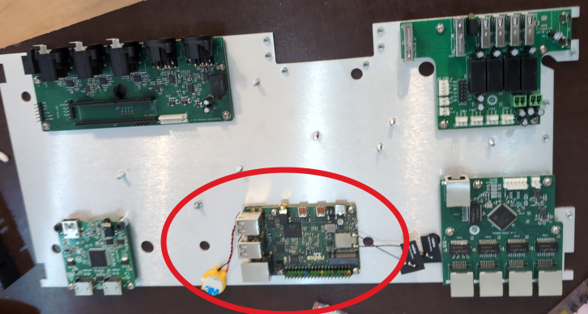

#### Clean radxa cpu (`clean_radxa_cpu`)

- Use a cotton swab and isopropyl alcohol to clean the CPU crystal

#### Prepare thermal pad (`prepare_thermal_pad`)

- Cut an approx 18x20mm rectangle of 1.5mm thick thermal pad
- Remove protecting films from both sides

#### Stick thermal pad on radxa (`stick_thermal_pad_on_radxa`)

- Stick thermal pad onto CPU crystal

#### Mount radxa on baseplate (`mount_radxa_on_baseplate`)

- Without tightening, screw the Radxa board with M3x4 bolts
- Tighten diagonally

#### Mount display holders on baseplate (`mount_display_holders_on_baseplate`)

- Screw the display holders onto the baseplate with M3x6 bolts

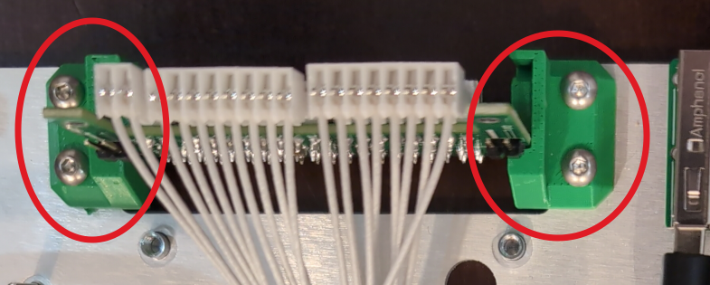

#### Mount hagibis rear on baseplate (`mount_hagibis_rear_on_baseplate`)

- Use M4x5 bolts in the two rear holes of the Hagibis capture card. They might require some effort to screw in - this is fine.
- This must be done before bolting the front holes, since the rear holes use thicker bolts that guide the board orientation.

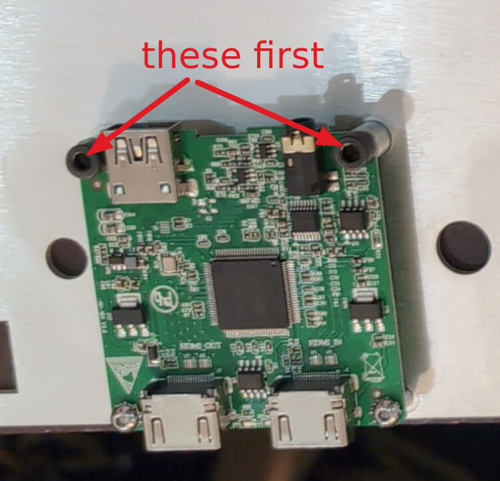

#### Mount hagibis front on baseplate (`mount_hagibis_front_on_baseplate`)

- Use M3x4 bolts

#### Mount switch, power and audio boards on baseplate (`mount_sap_on_baseplate`)

- Use M3x4 bolts to mount boards to the baseplate
- Tighten diagonally

#### Place display hat on display holders (`place_display_hat_on_display_holders`)

- The display hat PCB slides into the rear slit, while the display slides into the front slit
- The MTA100 connectors should be on top

#### Attach radxa hat (`attach_radxa_hat`)

- Press the Radxa hat down firmly onto the header

#### Base assembled (`base_assembled`)

Preparation is now done, and we can begin cable management.

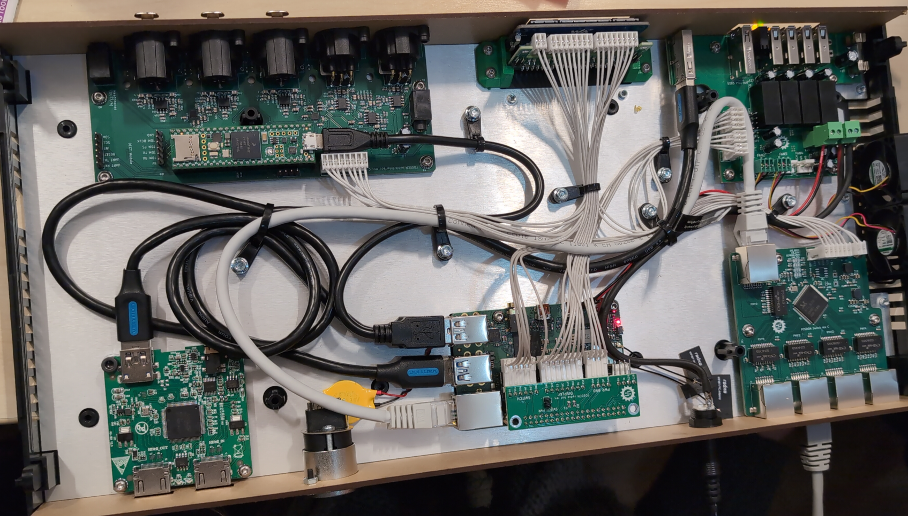

#### Connect power cable to power board (`connect_pwr_cable_to_pwr_board`)

- Insert the terminal into the right terminal (labeled "PWR IN").
- Do not swap the two terminals!

#### Connect radxa to power board (`connect_radxa_to_pwr_board`)

- Insert the terminal into the left terminal (labeled "PWR OUT").
- Do not swap the two terminals!
- On the radxa side, connect to "PWR IN" and match the negative cable - it is labeled with a minus:

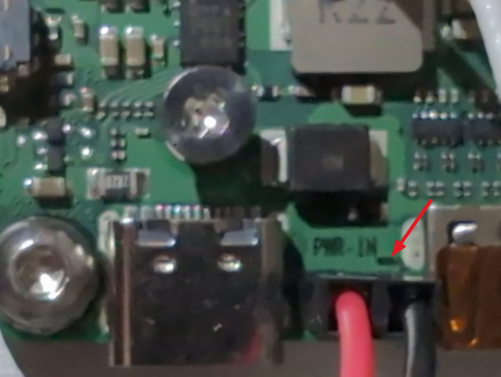

#### [Mark](https://github.com/markvdb) confusing MTA100 cables (`mark_duped_mta100_cables`):

- Use red paint (or nail polish) to mark the two end connectors of the following MTA100 cables:
    - The AudioBoard:DisplayHat cable (8pins, 225mm; the longer 8pin one)
    - The PowerBoard:Switch cable (2pins, 215mm; this is half of the 2pin cables)

#### [Mark](https://github.com/markvdb) confusing MTA100 connectors (`mark_duped_mta100_connectors`):

- Use red paint (or nail polish) to mark the following connectors on the PCBs:
    - The 8-pin connector on the Audio Board
    - The 8-pin connector labeled "SIDE" on the Display Hat
    - The 2-pin connector on the Switch Board
    - The 2-pin connector on the Power Board labeled "+5V"

#### Connect all 6 mta100 cables (`connect_all_6_mta100_cables`)

- Connect The following cables:
    - RadxaHat:Switch, 6pin, 275mm
    - RadxaHat:DisplayHat, 8pin, 185mm
    - RadxaHat:PowerBoard, 4pin, 180mm
    - PowerBoard:Switch, marked red, 2pin, 215mm
    - PowerBoard:DisplayHat, 2pin, 215mm
    - AudioBoard:DisplayHat, marked red, 8pin, 225mm

#### Connect audio jack cable (`connect_audio_jack_cable`)

- Connect the 3.5mm audio cable between the Hagibis audio output and the Audio Board's internal input

#### Connect fans to power brd (`connect_fans_to_pwr_brd`)

- Connect the fans to the FAN1 and FAN2 connectors on the power board

#### Connect micro usb cable (`connect_micro_usb_cable`)

- Connect the USBA-MicroUSB cable between the USB-2 port of the radxa (coloured black, not blue) and the teensy

#### Connect ptru usb cable (`connect_ptru_usb_cable`)

- Connect an USB-3 A-A cable between the Power Board internal USB-A connector and an USB-3 port on the Radxa

#### Connect hagibis usb cable (`connect_hagibis_usb_cable`)

- Connect an USB-3 A-A cable between the Hagibis internal USB-A connector and an USB-3 port on the Radxa

#### Connect ethernet cable (`connect_ethernet_cable`)

- Connect an RJ45 patch cable between the internal RJ45 port of the switch and the RJ45 port on the Radxa

#### Attach cables to baseplate (`attach_cables_to_baseplate`)

- Use screw-in cable ties to attach the cables to the baseplate
- Fix the cable ties in place with flanged nuts
- Use an already-built box as a template for the topology. If one is not available, ~use your imagination~ look at the picture in `base_assembled`!

#### Base wired (`base_wired`)

- We are now done with everything on the baseplate!

#### Attach front panel to audio brd (`attach_front_panel_to_audio_brd`)

- Be careful with the XLR connector pins
- Make sure the XLR connectors fit nicely into the holes

#### Slide base and panels into box (`slide_base_and_panels_into_box`)

- Make sure that the bottom half of the box is actually a bottom and not a lid
(the holes are drilled through, and if the box is an old one, one of the grill bars is broken)
- If the box is an old one, make sure the slit for fans on the baseplate is not oriented
towards the broken grill
- Slide the front panel and base assembly in

#### Attach onlyfans to box (`attach_onlyfans_to_box`)

- Use 3x 2.5mm-wide cable ties to tie through the bottom holes of the fans
    - One of them ties the two middle holes (next to each other) to one of the box bars
    - The other two tie the faraway holes on the two sides
- Make sure the tying happens on the inside, and not on the outside

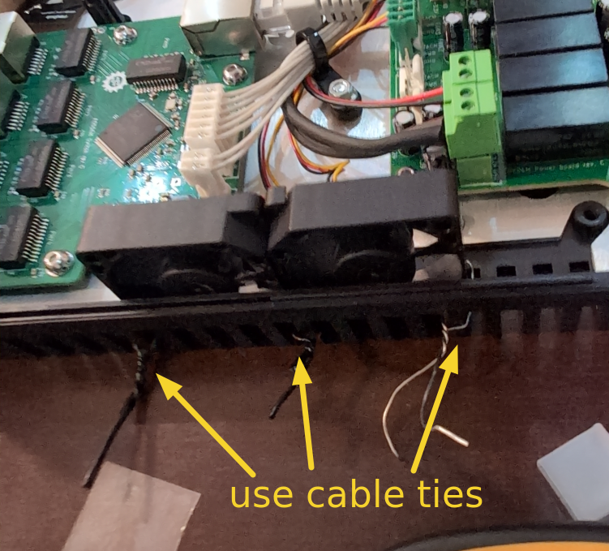

#### Attach base to box (`attach_base_to_box`)

- On all 6 accessible plastic columns, arrange the following:
    - 2x 1mm washers with 8mm internal diameter (bkp washers)
    - 1x 1mm washer with 3mm internal diameter
- Use M3x4 screws to fix them
    - **DO NOT TIGHTEN** - the plastic thread is very easy to snap!

#### Stick battery to baseplate (`stick_battery_to_baseplate`)

- Choose an appropriate slot to stick the battery, so that it doesn't dangle off the Radxa

#### Connect box to power and network (`connect_box_to_power_and_network`)

You know how to do this.

#### Verify blue smoke still inside (`verify_blue_smoke_still_inside`)

You know how to do this.

#### Record box id and MAC address (`record_box_id_and_mac_address`)

- Check DHCP for the mac address of the box
- Record it with its number in a file
- Label the box with its number

#### Click teensy bootsel btn (`click_teensy_bootsel_btn`)

- The Teensy bootsel button on the teensy

#### Run provisioning script (`run_provisioning_script`)

- **FIXME**: undocumented (do some ansible magic)

#### Verify status on display (`verify_status_on_display`)

- The audio displays should show levels
- The main display should show video-status (and not dr seus)

#### Insert 3D printed case locks into box slits (`insert_case_locks`)

- 4 locks

#### Close box (`close_box`)

- Make sure the front and back panels are firmly enclosed in their slits

#### Screw box shut (`screw_box_shut`)

- **FIXME**: I have no idea how to do this

#### Done (`done`)

- Drink some Rakia
