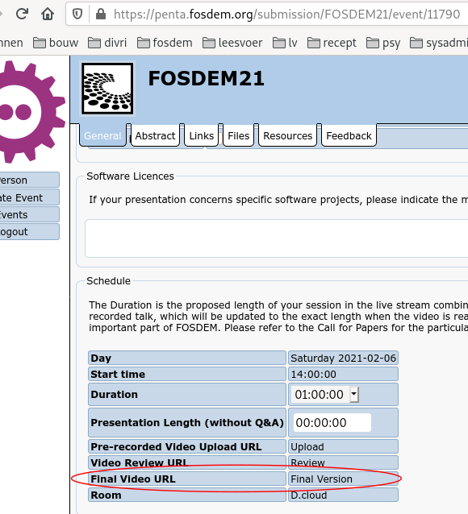

# FOSDEM 2021 video: speakers manual

In the below document, we'll assume that your talk's unique event id in the FOSDEM system is 123456 , and accessible at:
- https://penta.fosdem.org/submission/FOSDEM21/event/123456
- https://penta.fosdem.org/event/edit/123456

## Before FOSDEM 2021
### Talk video recordings
Here's what you'll need to do to get your talk video in:
- Submit your prerecorded video through https://penta.fosdem.org/submission/FOSDEM21/event/123456 .
- Your room manager will then review your talk.
- Make sure your room ends up marked with state "done" at https://upload.video.fosdem.org/overview .
- Validate your final video using the link at the bottom of https://penta.fosdem.org/submission/FOSDEM21/event/123456 . This is what will be broadcast at FOSDEM 2021. In case this looks good, no feedback is needed from you. In case of any issues, please contact [video@fosdem.org](mailto:video@fosdem.org) . Hints:
  - Never share this link. Share your talk's unique event id.
  - Particularly check the end of the video. Make sure FOSDEM has the full recording.

### Talk Q&A: audience interaction using Matrix/Jitsi
After your talk has been broadcast as prerecorded video, you will have a chance to address your audio's questions in a live broadcast q&a session. FOSDEM 2021 will use https://chat.fosdem.org for that. This is a **matrix server with FOSDEM specific enrichments** only available using the **https://chat.fosdem.org web client. Please do not use any other matrix client.**

Here's what you'll need to do for the q&a session to go smoothly:
- Accept your https://chat.fosdem.org invite. Create your matrix account on https://chat.fosdem.org .
  - Potential spam issue with gmail.

- Get familiar with the matrix rooms for your talk:
  - [#talk-123456:fosdem.org](https://chat.fosdem.org/#/room/#talk-123456:fosdem.org)
    - This room is invite only. It's accessible only to you as a speaker, your optional co-speakers, your q&a session host and FOSDEM staff.
  - The general audience room for your talk.
    - You should have received an invitation to this room.
    - Alternatively, you can derive your matrix room from the [schedule](https://fosdem.org/2021/schedule/events/). Examples: D.cloud => [#cloud:fosdem.org](https://chat.fosdem.org/#/room/#cloud:fosdem.org), M.misc => [#misc:fosdem.org](https://chat.fosdem.org/#/room/#misc:fosdem.org) .
  
### Help! Something is wrong. Whom do I contact?
- For issues regarding https://upload.video.fosdem.org , please email [video@fosdem.org](mailto:video@fosdem.org). You may also be able to reach wouter live in the [#video:fosdem.org](https://chat.fosdem.org/#/room/#video:fosdem.org) matrix room.
- For issues regarding matrix, please email [experience@fosdem.org](mailto:experience@fosdem.org) . You may also be able to reach other speakers and the FOSDEM team live in the [#speakers:fosdem.org](https://chat.fosdem.org/#/room/#speakers:fosdem.org) matrix room.
  
## During FOSDEM 2021
Your talk is happens in three stages:
1. Your prerecorded video is broadcast.
2. You can answer audience questions during q&a.
3. You can speak to the super interested fraction of your audience in the hallway track.

### 1. Prerecorded talk video broadcast
Assuming you followed the steps outlined under "Before FOSDEM 2021", there's nothing you'll need to do.

### Help! Something is wrong. Whom do I contact?
You can reach the FOSDEM team in the [#speakers:fosdem.org](https://chat.fosdem.org/#/room/#speakers:fosdem.org) matrix room.

## After FOSDEM 2021
When agreeing to speak at FOSDEM, you explicitly granted FOSDEM vzw the right to publish your video under a CC BY-SA license. Your video will be uploaded to the FOSDEM video archive at https://video.fosdem.org .

### Help! Something is wrong. Whom do I contact?
- For issues regarding your video at https://video.fosdem.org , please email [video@fosdem.org](mailto:video@fosdem.org) .
- For issues regarding the https://video.fosdem.org site in general, please email both [video@fosdem.org](mailto:video@fosdem.org) and [server@fosdem.org](mailto:server@fosdem.org) .
