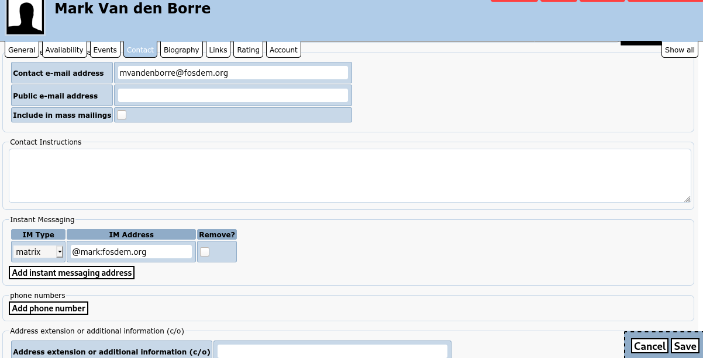

*** THIS IS A LIVING DOCUMENT. PLEASE CHECK BACK OFTEN OR SUBSCRIBE TO THE CHANGES! ***
# FOSDEM 2022 video: speakers manual

In the below document, we'll assume that your talk's unique event id in the FOSDEM system is 123456 , and accessible at:
- https://penta.fosdem.org/submission/FOSDEM22/event/123456
- https://penta.fosdem.org/event/edit/123456

## Before FOSDEM 2022
### Talk video recordings
Here's what you'll need to do to get your talk video in:
- Submit your prerecorded video through https://penta.fosdem.org/submission/FOSDEM21/event/123456 .
- Your room manager will then review your talk.
- Make sure your room ends up marked with state "done" at https://upload.video.fosdem.org/overview .
- Validate your final video using the link at the bottom of https://penta.fosdem.org/submission/FOSDEM21/event/123456 .

This is what will be broadcast at FOSDEM 2022. In case this looks good, no feedback is needed from you. In case of any issues, please contact [video@fosdem.org](mailto:video@fosdem.org) . Hints:
  - Never share this link. Share your talk's unique event id.
  - Particularly check the end of the video. Make sure FOSDEM has the full recording.

### Talk Q&A: audience interaction using Matrix/Jitsi
After your talk has been broadcast as prerecorded video, you will have a chance to address your audience's questions in a live broadcast q&a session. FOSDEM 2022 will use https://chat.fosdem.org for that.

**Note:** This is a **matrix client with FOSDEM specific tweaks only available using the https://chat.fosdem.org**. As a speaker, please do not use any other matrix client.** Using a matrix account with a different matrix server (eg: @yourname:matrix.org) is fine though.

Please prepare well beforehand for the q&a session to go smoothly:
- Make sure you have access to a comfortably large screen. >= 24" screen size and >= 1920x1080 resolution would be comfortable. Things will work on a 12" 1366x768 laptop screen, but usability will suffer. Juggling an outgoing video stream, chat messages and a question scoreboard on a small screen is not fun.
- Accept your https://chat.fosdem.org invite. Create your matrix account on https://chat.fosdem.org .
- Add your matrix account to your https://penta.fosdem.org profile: person->im->matrix. This will help in assigning you the right  permissions as a speaker in https://chat.fosdem.org .

- Join the following rooms:
  - the backstage matrix room for your talk, which you will be invited to.
    - This room is invite only. It's accessible only to you as a speaker, your optional co-speakers, your q&a session host and FOSDEM staff.
    - You should have received an invitation by email. In case you have trouble getting in, any FOSDEM staff should be able to invite you here.
  - [#speakers:fosdem.org](https://chat.fosdem.org/#/room/#speakers:fosdem.org)
    - This room is invite only. It's accessible to all speakers and FOSDEM staff.
    - You should have received an invitation by email. In case you have trouble getting in, any FOSDEM staff should be able to invite you here.
  - the general audience room for your talk.
    - You should have received an invitation to this room.
    - Alternatively, you can derive your matrix room from the [schedule](https://fosdem.org/2022/schedule/events/). Examples: D.cloud => [#cloud-devroom:fosdem.org](https://chat.fosdem.org/#/room/#cloud-devroom:fosdem.org), M.misc => [#misc:fosdem.org](https://chat.fosdem.org/#/room/#misc:fosdem.org) .
  
### Help! Something is wrong. Who do I contact?
- For issues regarding https://upload.video.fosdem.org, please email [video@fosdem.org](mailto:video@fosdem.org). You may also be able to reach wouter live in the [#video:fosdem.org](https://chat.fosdem.org/#/room/#video:fosdem.org) matrix room.
- For issues regarding the https://video.fosdem.org site in general, please email both [video@fosdem.org](mailto:video@fosdem.org) and [server@fosdem.org](mailto:server@fosdem.org) .
- I have a problem connecting to https://chat.fosdem.org at all.
  - Please email [experience@fosdem.org](mailto:experience@fosdem.org) or try irc://irc.freenode.net#fosdem .
- I have an active matrix account, but a problem getting into my talk's private room for q&a.
  1. Make sure your matrix id is set in your profile in https://penta.fosdem.org .
  2. If you're speaking in a developer room, first try to contact your developer room manager. They are your first point of contact and should be able to let you in.
  4. If that doesn't work, you should be able to reach other speakers and some on the FOSDEM team live in the [#speakers:fosdem.org](https://chat.fosdem.org/#/room/#speakers:fosdem.org) matrix room. Have the following info ready to get help more quickly and efficiently:
    - your personal penta id. Example: https://penta.fosdem.org/person/edit/8319 is your profile => 8319 is your personal penta id.
    - your talk's penta id. Example:  https://penta.fosdem.org/event/edit/11164 is your talk profile => 11164 is your talk's penta id.

## How to participate as a speaker at FOSDEM 2022

As a speaker, you need a Matrix account.  You should already have been invited by email (or Matrix, if we know your Matrix ID) to sign up to Matrix and join the relevant chatrooms.  If not, you can get a Matrix account at https://chat.fosdem.org.  Then, to receive the invites, please enter your Matrix ID (e.g. @matthew:fosdem.org) under your account details on https://penta.fosdem.org (look for the 'Add instant messaging address' button on your Person page) and you'll be invited shortly. We send out invites a few times a day.

You should be invited to:
 * [#speakers:fosdem.org](https://matrix.to/#/#speakers:fosdem.org) (the main coordination point for speakers)
 * The backstage room for your devroom, where you can coordinate with the devroom organisers and your hosts
 * The devroom itself.
 * ...and shortly, the room for your talk itself.

### The talk room

Your talk room is where you will meet your host, and watch your pre-recorded talk as it is broadcast, and then do a live Q&A with your host about the talk.

**You must join the video conference in the talk room before your talk is broadcast, so you can follow along and then participate in the Q&A session.**

The FOSDEM bot in the room will prompt you to check in to the room before the talk by sending a message.  **If you do not, the system will assume you are absent and skip the Q&A session.**

During the talk, the room will look something like this:

Above the chat messages you can see two "widgets" (embedded webapps):

1. The left-hand one called "Livestream / Q&A" is the room's video conference.  This starts off showing a stream of the room's video conference; **to join the conference you must hit the Join Conference button in the top right**. 
2. The right-hand one called "Upvoted messages" is the 'scoreboard' tracking questions posed during your talk.  As users upvote questions in the devroom while your talk is in progress, they will appear here, ordered by the number of upvotes. This helps you track which questions to answer in your Q&A.

Once the prerecorded talk has been broadcast on the livestream, **your video conference will be broadcast live to the devroom as part of the recording of your talk**.  The host will then relay questions from the audience and interview you in a live Q&A session.

Finally, at the end of the Q&A session, the audience in the devroom is invited to join the talk room to continue discussing the talk or asking questions directly (including joining the video conference if they wish).  The chat history of the talk room is not visible to them.  The video conference is no longer streamed to the devroom or recorded (but is visible to those in the talk room).  This is equivalent to members of the audience coming to ask you questions in the hallway after your talk, and gives your talk a permanent chatroom for posterity.

In case of moderation problems, the speaker and host (and any other moderators in that Matrix room) have permission to kick/mute users from the video conference - using the small `...` menu in the top right of that user's video feed.  Users can also be kicked and banned from the Matrix room.  In case of difficulty, please ask for help in #speakers:fosdem.org.

The FOSDEM bot will send updates into the talk room during the talk to let you know what's happening.  The sequence of messages is as follows:

### The devroom

During your talk, you can switch room to the devroom to join the audience and follow along with what people are saying, watch the livestream, while keeping on the video conference (which appears in the bottom right):

During the talk, the FOSDEM bot will send updates into devroom so the audience knows what's going on.  These are as follows:

The prerecorded talk then plays on the livestream.

Your video conference is then broadcast to the livestream so the audience can see your host interview you with their questions.

The audience can then join the talk room to continue discussing your talk with you and your host.

## During FOSDEM 2022 (alternative instructions):

Your talk is happens in three stages:
1. Your prerecorded video is broadcast.
2. You can answer audience questions during q&a.
3. You can speak to the super interested fraction of your audience in the hallway track.

### 1. Prerecorded talk video broadcast
Did you follow the steps outlined under "Before FOSDEM 2022"? Then your talk will be broadcast at the [scheduled](https://fosdem.org/2022/schedule/events/) time, the FOSDEM audience will see a 30 seconds preroll slide, followed by your talk. These videos will be available in the following places:
- https://fosdem.org : integrated into the page for your track.
- https://live.fosdem.org/watch/<track> (example: https://live.fosdem.org/watch/dcollab) 
- the FOSDEM matrix room for your talk (example: [https://chat.fosdem.org/#/room/#misc:fosdem.org](https://chat.fosdem.org/#/room/#misc:fosdem.org)
- (most of) the FOSDEM apps available at https://fosdem.org/2022/schedule/mobile/

Be in your talk's backstage room at the start of your talk's broadcast.

As soon as your prerecorded talk is being broadcast,  immediately join the embedded jitsi conference in your backstage room. You talk broadcast will switch over to that after the end of your prerecorded talk. 

Monitor your track's public room for interesting general audience questions and think of intelligent answers. **Hints**:
  - Use the scoreboard widget. It gathers popular upvoted questions from the public room.
  - Enlist the help of your backstage room host. They are there to help you!

**IMPORTANT: How to know exactly when your q&a session goes live?**
- A bot in the room will warn you when your q&a is to go live.
- To be 200% sure, calculate your q&a start time yourself. Example:
  - Your scheduled start wall clock time is 10:00:00 am.
  - Add 30 s for a preroll (title) slide. 10:00:30 am.
  - Add the length of your talk video. Let's say it's 17:32 long.
  - Your q&a starts at 10:18:02 am.
- **Do not rely on the public video stream** to decide when to start speaking live. Due to mixing, buffering, there is a time delta between seeing on the public stream and starting your q&a video. You don't want to keep your audience waiting between your talk and the q&a!

### 2. Answering audience questions during q&a
You now have the opportunity to answer audience questions in a q&a session.

**Hints:**
  - Use your talk host's help. They can keep an eye on audience feedback from the public room chat.
  - When your time is up, your talk will automatically switch over to the next talk.

### 3. Hallway track
Think of this as a minority of the audience clustering around the speaker for an informal chat in the hallway after the talk has ended.

Once the live q&a is over, your backstage room will open up to the general audience. Audience members can then come and talk to you.

If you want to make sure your audience finds its way to this hallway track, make some publicity around it near the end of your q&a session. Example: "Any further questions? Would you like to speak to me? Join me now in matrix room #talk-123456 for an interactive video chat.".

## After FOSDEM 2022
When agreeing to speak at FOSDEM, you explicitly granted FOSDEM vzw the right to publish your video under a CC BY-SA license. Your video will be uploaded to the FOSDEM video archive at https://video.fosdem.org .

