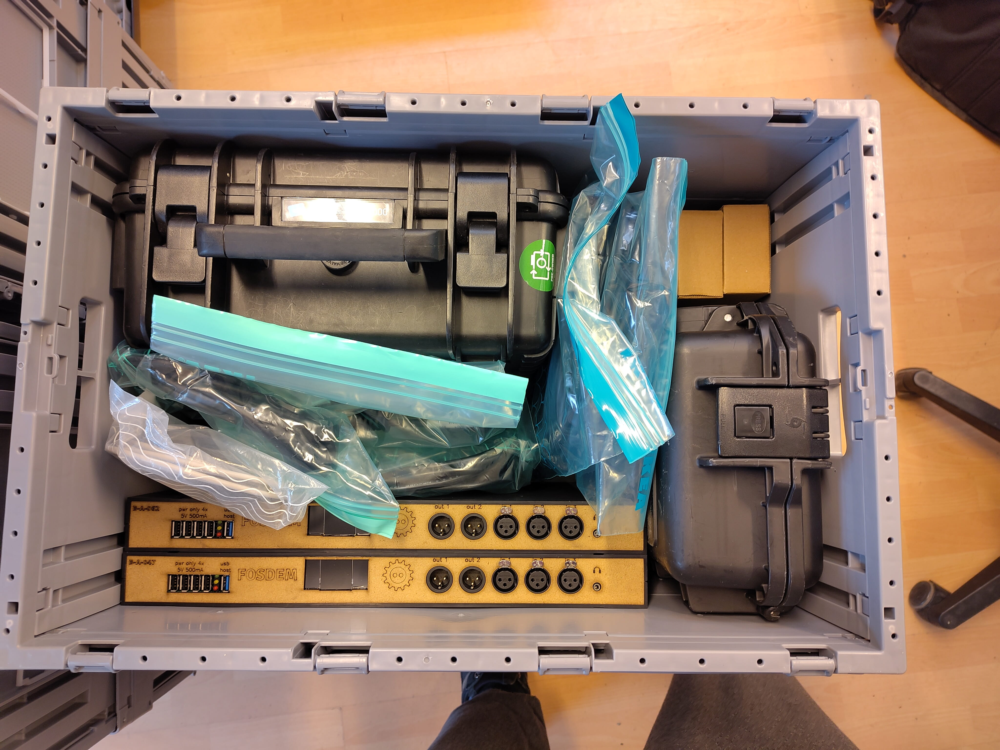

| Video buildup checklist for room **ROOM_NUMBER** |
| --- |
| **Anything not included / wrong in the box? Leave feedback on this paper** |
|`[ ]` Bring equipment to room ROOM_NUMBER|
|`[ ]` Unpack tripod|
|`[ ]` Place tripod at CAMERA_POSITION|
|`[ ]` Level tripod|
|`[ ]` Install camera on tripod|
|`[ ]` Connect camera power and install camera battery
|`[ ]` Set INPUT1 to LINE on 1st slider, EXT on 2nd slider, MAN on 3rd slider
|`[ ]` Set INPUT1 to 5 on volume knob
|`[ ]` Set INPUT2 to MIC/MIC +48V on 1st slider, INT MIC on 2nd slider, MAN on 3rd slider
|`[ ]` Set INPUT2 to 5 on volume knob
|`[ ]` Set camera resolution to 1920x1080 and refresh rate to 50p|
|`[ ]` Remove lens cover of camera
|`[ ]` Install camera box (odd number) on tripod with zip ties|
|`[ ]` Connect camera box (odd number) to power
|`[ ]` Connect camera to camera box with HDMI cable
| |
|`[ ]` Install slides box (even number) on desk
|`[ ]` Connect slides box (even number) to power
|`[ ]` Connect internet (red cable left by the network team) to any port on slides box
|`[ ]` Connect speaker(clip-on) micropohone to IN3 on slides box
|`[ ]` Connect audience(handheld) microphone to IN2 on slides box
|`[ ]` Connect short XLR cable from OUT2 on slides box to room audio or FOSDEM-provided loudspeaker
|`[ ]` Connect charging cables from slides box USB ports to microphone receiver's batteries
|`[ ]` Connect charging cables from slides box USB ports to microphone transmitter's batteries - Always have batteries charging
|`[ ]` Connect HDMI cable from slides box HDMI LOOP to room projector - may need to use HDMI->VGA converter
|`[ ]` Connect HDMI cables to slides box HDMI IN port to be used by presenter - leave other end on desk
|`[ ]` Connect XLR cable from OUT1 on slides box to INPUT1 on camera - check suggested cable route at bottom
|`[ ]` Run ethernet cable from any port on slides box to any port on camera box - check suggested cable route at bottom
| |
|`[ ]` Connect headphones to camera|
|`[ ]` Write room name on the whiteboard to point camera to|
|`[ ]` Point camera to where speaker will be without getting presentation in frame|
|`[ ]` Mark on floor where speaker should be (skip for Janson, K.1105 and H.2215)|
|`[ ]` Leave signs folder on desk next to slides box
| |~~~~
|&nbsp;&nbsp;&nbsp;&nbsp;**Tests**|
|`[ ]` Make sure you see picture on camera box|
|`[ ]` Make sure you see picture on slides box and projector when there's signal present|
| |
|`[ ]` Talk into all microphones and check levels|
|`[ ]` &nbsp;&nbsp;&nbsp;&nbsp;Within 80% on camera|
|`[ ]` &nbsp;&nbsp;&nbsp;&nbsp;No noise|
|`[ ]` &nbsp;&nbsp;&nbsp;&nbsp;Audible in room|
|`[ ]` &nbsp;&nbsp;&nbsp;&nbsp;No feedback - make sure to walk around with microphones|
||
|`[ ]` Repeat microphone test with VOC|
|`[ ]` &nbsp;&nbsp;&nbsp;&nbsp;Ask VOC member to call you, in Matrix |
|`[ ]` &nbsp;&nbsp;&nbsp;&nbsp;Make sure that a VOC member had ACKnowledged your request|
|`[ ]` &nbsp;&nbsp;&nbsp;&nbsp;When a VOC member is available, they'll call via Matrix|
|`[ ]` &nbsp;&nbsp;&nbsp;&nbsp;Test both mics and confirm levels |
||
|`[ ]` Make sure VOC sees both video sources|
|`[ ]` If no issues are seen from VOC, connect microphone batteries to chargers|
|`[ ]` **Tape this checklist to camera box**|

Suggested route for XLR and network cable is as follows: CABLE_RUN

\newpage

## Teardown instructions

{ width=\\textwidth }

This is the best layout for the pelicancases, videoboxes (and their PSU's) and fit everything else around or above it.

- Roll up each cable and put it back it's bag
- Be sure to put the room box contents checklist at the very top inside of the box once you're done
